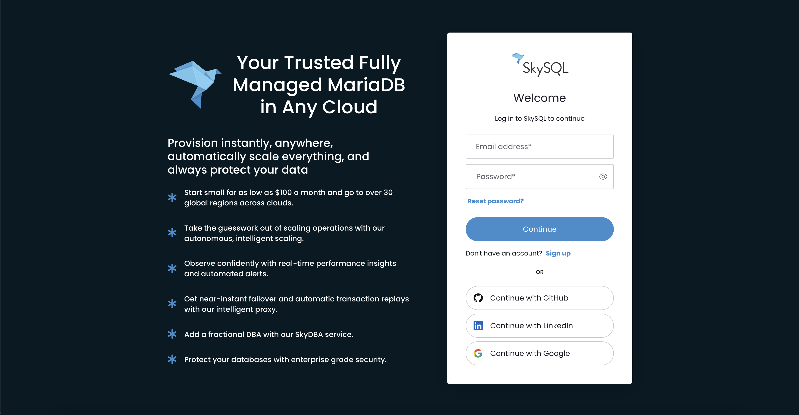
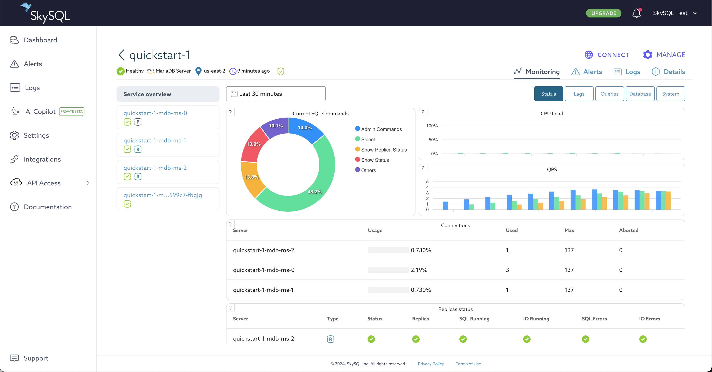
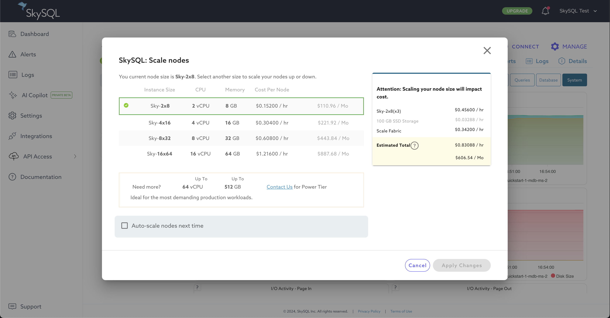

# Quickstart

It only takes a few minutes to launch a standalone or clustered database on SkySQL. You can pick from about 30 global regions and launch on AWS or GCP. 

You have three choices to provision a DB on SkySQL :

This Quickstart explains how to launch database services and manage the lifecycle of database services using the [Portal](<../Portal features>) in a web browser.

For users who prefer other interfaces, SkySQL offers the following alternatives:

- Use the SkySQL web [Portal](<../Portal features>). Make your choices with a few clicks and hit Launch.
- Use the DBaaS API with a REST client
- Use the [Terraform provider](<Launch DB using the Terraform Provider>)

## Step 1: Register for SkySQL

Goto [app.skysql.com](https://app.skysql.com) to sign up. You can sign up using your Google, Github or LinkedIn credentials. Or, just use your Email address to sign up. 

## Step 2: Launch a Service

1. [Log in to the SkySQL Portal](https://app.skysql.com/) and from the Dashboard, click the [+ Launch New Service](https://app.skysql.com/launch-service) button.

2. From the launch interface, select the choices detailed below.
        
    Select:
    
    - Transactions and then `Enterprise Server with Replicas`
    - `AWS` and `Ohio, USA (us-east-2)`, or `Google Cloud` and `Iowa, USA (us-central1)`, or a region of your choice
    - Since this Quickstart is a simple test, select:
        - The smallest instance size `ARM64`, `Sky-2x8` for AWS 
        - `100GB` of `gp3` storage with default `3000 IOPS` and `125 MB/s` throughput
    - Name the service "`quickstart-1`
    - Select `Add my current IP: 99.43.xxx.xxx` in the `Security` section
    - Then, click the `Launch Service` button.
        
    
        
    For additional information on available selections, see "[Service Launch](<../Portal features/Launch page.md>)".
        
3. You will be returned to the Dashboard where your service will be in a `Creating` state. 

When the service reaches "Healthy" state, go to the next step. It typically takes about 5 mins or less to launch a new DB. 

## Step 3: Observe, Scale

### Monitoring

You can monitor all the important database and OS metrics from the dashboard. The monitoring UI also allows you to view,download any/all logs - error, info or Audit logs. 

Basic status is shown on the Dashboard.

To see expanded status and metrics information:

1. From the Dashboard, click on the service name. (This is "quickstart-1" if you used the suggested name.)
2. From the Monitoring Dashboard, you can choose to view service (`Service Overview`) or server details from the navigation tabs.
3. Specific views are provided for different sets of metrics. These views can be accessed using the buttons in the upper-right corner. From the service overview, views include `Status`, `Lags`, `Queries`, `Database` and `System`.
    
    
    
    *Monitoring Dashboard*
    
### Scaling

SkySQL features automatic rule-based scaling (Autonomous) and manual on-demand scaling.

With automatic scaling, node count (horizontal) and node size (vertical) changes can be triggered based on load. Additionally, storage capacity expansion can be triggered based on usage. These Autonomous features are opt-in. For additional information, see "[Autonomous](<../Autonomously scale Compute, Storage/>)".

*Autonomous*

With manual scaling, you can perform horizontal scaling (In/Out), vertical scaling (Up/Down), and storage expansion on-demand using Self-Service Operations. For additional information, see "[Self-Service Operations](<../Portal features/Manage your Service.md>)".

*Self-Service Scaling of Nodes*

## Step 4: Tear-down

When you are done with your testing session, you can stop the service. When a service is stopped, storage charges continue to accrue, but compute charges pause until the service is started again.

When you are done with testing, you can delete the service.

Stopping, starting, and deleting a service are examples of Self-Service Operations that you can perform through the Portal.

For additional information, see "[Self-Service Operations](<../Portal features/Manage your Service.md>)".

[Launch DB using the REST API](<Launch DB using the REST API>)

[Launch DB using the Terraform Provider](<Launch DB using the Terraform Provider>)
