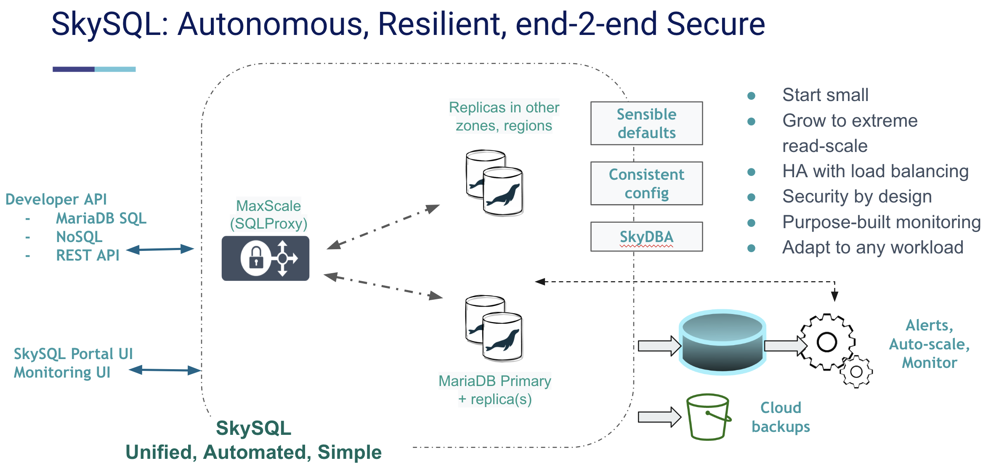

# Introduction to SkySQL 

MariaDB is one of the most popular, mature open source relational databases in the world. MariaDB is designed to be highly compatible with MySQL, as it was originally forked from MySQL. 

SkySQL is a multi-cloud, fully managed Database as a Service. It is specifically designed to manage MariaDB across data centers, regions and even across cloud providers. 
SkySQL was originally developed at [MariaDB](http://mariadb.com) with the goal to be the most comprehensive cloud platform for MariaDB. Its practical feature set was based on many years of insights gleamed from hundreds of customers running mission critical workloads. The core team that built SkySQL is now part of a new independent company called SkySQL (Established in late 2023). 

SkySQL brings production-grade capabilities to MariaDB – Automate complex DB configuration, augment your DB with cloud native features like VPC/auto-scaling, replicate anywhere across the globe, automate backups, manage data very securely with end-2-end encryption and compliance and much much more.

## Key Features of SkySQL

### Multi Cloud
Today it is available in more than 30 global regions across AWS and GCP clouds. Azure support is coming soon. 

### High Availability (HA)
- **Resilient Architecture:** Protects disks, compute, zones/cloud regions, network, and load balancer to ensure minimal downtime.
- **Intelligent Proxy:** Seamlessly handles failover and replication lag monitoring. The proxy ensures that failover processes, which typically complete within seconds, do not interrupt service.
- **Automated Failover:** Utilizes real-time health checks and automatic failover mechanisms to minimize recovery time and maintain service continuity.

### Scalability
- **Intelligent Load Balancing:** Maintains data consistency with an intelligent proxy that handles load balancing and read-write splitting.
- **Consistency Models:** Supports both causal consistency for applications that can tolerate slight delays and strong global consistency for those requiring immediate data consistency.
- **Custom Routing:** Offers the ability to define custom routing rules for database queries to optimize performance based on application needs.

### Disaster Recovery
- **Cross-Region/Provider Replication:** Ensures data is replicated across different regions and cloud providers, providing robust disaster recovery capabilities.
- **Configurable External Replicas:** Allows the setup of external replicas for additional data redundancy and flexibility in disaster recovery scenarios.

### Data protection
- **Comprehensive Backup Service:** The service goes well beyond nightly full backups to offer customers the ability to take incremental backups, DB snapshots, physical backup (mariaDB standard format), binlog backups to SkySQL managed storage or to customer managed storage. For instance, apps can continuously stream binlogs every few mins to achieve a near-zero RPO. 

### Auto-scaling of both Compute and Storage
- **Predictive Scaling:** Automatically adjusts storage resources based on predictive analysis of usage patterns.
- **Proactive Scaling:** Scales resources proactively to match demand, ensuring cost-efficiency by scaling down during low usage periods.

### Fractional DBA Service
- **SkyDBA Service:** Provides access to expert database administrators who proactively manage and optimize the database environment.
- **Performance Monitoring:** Continuous monitoring and optimization to ensure peak performance and quick resolution of any issues.

### Interoperability
- **Multi-protocol Support:** Supports JSON and SQL operations from a single data source, providing flexibility in application development.
- **MongoDB and MariaDB/MySQL Protocols:** Efficiently handles data through native support for MongoDB and MariaDB/MySQL protocols, enabling seamless integration with existing applications.

For more detailed information, you can refer to the original blog on the [SkySQL website](https://skysql.com/2024/03/12/optimizing-database-resilience-and-cost-a-deep-dive-into-skysqls-unique-features/).
